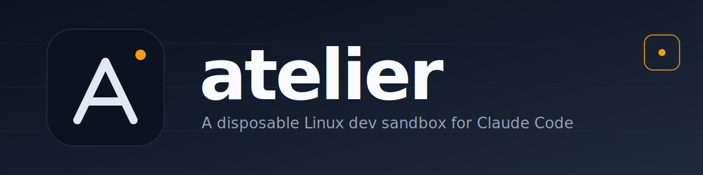

<!-- markdownlint-disable MD041 first-line-h1 -->
<p align="center">
  <a href="README.md">
    
  </a>
</p>

<p align="center">
  <strong>macOS + Claude Code, isolated in a disposable Linux VM. Your host stays clean.</strong>
</p>

<p align="center">
  <a href="README.md"><b>English</b></a>
  ·
  <a href="README.zh-CN.md">中文</a>
</p>

<p align="center">
  <a href="LICENSE"></a>
  <a href="https://orbstack.dev"></a>
  <a href="https://github.com/toolazytoname/atelier/actions/workflows/ci.yml">
    
  </a>
  <a href="https://github.com/toolazytoname/atelier/releases"></a>
  <a href="https://github.com/toolazytoname/atelier/discussions"></a>
  
  
</p>

---

*atelier* (French: **workshop**) is a self-contained, **disposable Linux
dev sandbox**. Code, builds, tests, and dependencies all live inside an
OrbStack Linux VM; the host Mac is reduced to a terminal and OrbStack
itself. Nothing — no Node, no Python, no Go, no Rust, no MCP
servers — is installed on your Mac. It all lives in the VM, dies with the
VM, and rebuilds from scratch in ~5 minutes.

The payoff: run Claude Code with `--dangerously-skip-permissions` and the
blast radius is the VM, not your laptop.

> **Prerequisites:** macOS only (13+, Apple Silicon recommended; Intel
> works) with [OrbStack](https://orbstack.dev) installed — the only host
> dependency. Linux/Windows are not supported; see
> [docs/comparison.md § "What if I'm not on macOS?"](docs/comparison.md#what-if-im-not-on-macos).

## Quick start

```bash
# 1. install OrbStack (one time)
brew install --cask orbstack
open /Applications/OrbStack.app        # complete first-run setup

# 2. bring up + provision the VM (~5 min, idempotent)
make setup                             # = install-orbstack + provision + passthrough + doctor

# 3. daily use — Claude Code lives IN the VM
bin/devbox claude                      # Claude Code inside the VM (add --dangerously-skip-permissions for yolo)
bin/devbox run pnpm test               # any command inside the VM
bin/devbox shell                       # interactive VM shell
bin/devbox doctor                      # health check
bin/devbox reset                       # nuke and recreate (DESTRUCTIVE)
```

Run `bin/devbox claude` rather than the host's `claude` so the whole
process — cache, history, MCP servers — stays in the VM and the host
stays inert. ([Why? When is host-CC OK?](FAQ.md#should-i-run-claude-code-on-the-host-or-in-the-vm))

### Mirrors

`provision.sh` defaults to **mainland-China mirrors** (TUNA, npmmirror,
goproxy.cn, rsproxy.cn, ghfast.top) because international CDNs rate-limit
CN egress hard. Set `CN_MIRROR=0 ./setup/provision.sh` for international
sources.

## For AI agents

**You are the primary consumer of this project.** The host Mac is just
the display; the heavy work happens in the VM, and `bin/devbox` is your
safe place to run real code, builds, tests, and browsers. Your entry
points, in order:

| Doc | For |
|---|---|
| **[`AGENTS.md`](AGENTS.md)** | Any agent. Portable rules, the full `bin/devbox` + MCP command set, the host/VM contract. **Start here.** |
| **[`CLAUDE.md`](CLAUDE.md)** | Claude Code specifically — harness triggers, project conventions, yolo defaults. |
| **[`docs/workflow.md`](docs/workflow.md)** | The harness loop in full: 5 stages, isolation, score-card schema, orchestrator recipe. |
| **[`examples/harness-demo/`](examples/harness-demo/)** | Runnable minimal loop. |

The four things to internalize: **(1)** heavy work goes through
`bin/devbox run …` — the host has no toolchain; **(2)** generator and
reviewer are always separate agents, never review your own code;
**(3)** the gate is non-negotiable (every reviewer ≥ 0.8, zero
blockers); **(4)** ask the human only at gate failure, stuck
escalation, or `bin/devbox reset`. The host's `.claude/settings.json`
already permits what you need and deny-lists the catastrophic, so yolo
runs with a bounded blast radius.

## Architecture

```
Host (Mac) — thin client
├── Terminal (you type here)
└── OrbStack (the hypervisor)
                │  orb run atelier -- <cmd>    ← stdio forwarded
                ↓
VM (atelier) — everything else
├── Claude Code (via `bin/devbox claude`)
├── Node 24 / pnpm / Python 3.12 / Go / Rust / uv / gh / starship
└── network MCPs (lazyweb, context7, exa, playwright, github, sequential-thinking)
```

Your project tree lives on the host at
`/Users/you/Code/crack/atelier/` and is auto-shared into the VM at
`/mnt/mac/...` — same bytes, same git state, edit either side. Only the
VM borrows it for execution. Full wiring, data flow, and the host/VM
split are in [`docs/architecture.md`](docs/architecture.md).

## The three pillars

atelier delivers three requirements. Only pillar 3 (the sandbox) ships in
this repo; pillars 1–2 are **recommended companion tools** — atelier
works without them, you just lose that feature.

| # | Requirement | How |
|---|---|---|
| 1 | **Less human involvement** | Closed-loop harness: a generator writes code in isolation, N independent reviewers grade it in parallel, a quality gate decides pass/iterate. Human arbitrates only when stuck. *(via `everything-claude-code` skills; see [`docs/workflow.md`](docs/workflow.md))* |
| 2 | **Catch what self-test misses** | The `verify` skill, `e2e-runner`, the multi-agent `council`, Playwright screenshots. |
| 3 | **Isolated VM** | **Bundled.** OrbStack Ubuntu 24.04 VM, every tool inside, `bin/devbox reset` rebuilds in ~5 min, host untouched. |

## File layout

```
.
├── README.md / README.zh-CN.md   # this file (EN / 中文)
├── CLAUDE.md / CLAUDE.zh-CN.md    # Claude Code instructions (EN / 中文)
├── AGENTS.md                      # portable entry point for any AI agent
├── FAQ.md                         # questions + troubleshooting
├── CONTRIBUTING.md · CHANGELOG.md · SECURITY.md · LICENSE
├── Makefile                       # make setup / doctor / reset / shell
├── assets/                        # logo / banner / social-card SVGs
├── .claude/settings.json          # sandbox allow list + yolo backstop deny
├── .mcp.json                      # atelier sandbox MCP bridge config
├── bin/
│   ├── devbox                     # host wrapper: run / shell / claude / reset / doctor
│   └── mcp-atelier.py             # stdio MCP server wrapping bin/devbox --json
├── docs/
│   ├── design.md                  # why this project exists (three pillars)
│   ├── architecture.md            # components, data flow, host/VM split
│   ├── comparison.md              # vs Docker Desktop / Lima / Vagrant / Multipass
│   ├── security-model.md          # yolo-safety model: walls, threats, limits
│   └── workflow.md                # the harness loop: 5 stages + isolation
├── examples/harness-demo/         # runnable harness loop: spec + orchestrate.py
└── setup/                         # install-orbstack / provision / host-passthrough / uninstall
```

## The yolo-safety model

The point is **yolo with a bounded blast radius**: the architecture is
the wall, the deny list is the backstop.

- **The wall** — the host is inert. Every mutating op routes through
  `bin/devbox run` into the VM. `.claude/settings.json` allow-lists only
  the sandbox driver + observation tools; anything else needs explicit
  grant.
- **The backstop** — under `--dangerously-skip-permissions` only the
  deny list bites, and it covers only the unrecoverable: `rm -rf /`,
  `sudo`, `curl|bash`, credential stores (`~/.ssh`, `~/.aws`, …).

Full threat model, the three layers, and what it deliberately does
*not* defend against: [`docs/security-model.md`](docs/security-model.md).

## Why OrbStack, not "just Docker"?

OrbStack gives a *real* Linux VM (full init, kernel isolation, disk
image) plus a native macOS Docker daemon, faster and lighter than Docker
Desktop on Apple Silicon, with disposable VMs that `bin/devbox reset`
rebuilds in seconds. The head-to-head vs Docker Desktop / Lima / colima /
Vagrant / Multipass / Apple's `container` is in
[`docs/comparison.md`](docs/comparison.md).

## Troubleshooting

Common symptoms and fixes live in [FAQ.md](FAQ.md#troubleshooting)
(e.g. `orb: command not found`, VM not running, token not seen in the
VM). The quickest recovery from a
suspect VM is always `bin/devbox reset` — it's a VM, the blast radius is
bounded, and the host filesystem is untouched.

## Contributing

See [CONTRIBUTING.md](CONTRIBUTING.md). Deeper rationale lives in
[`docs/design.md`](docs/design.md); common questions in [FAQ.md](FAQ.md);
security disclosure in [SECURITY.md](SECURITY.md).

## License

[MIT](LICENSE)
</content>
